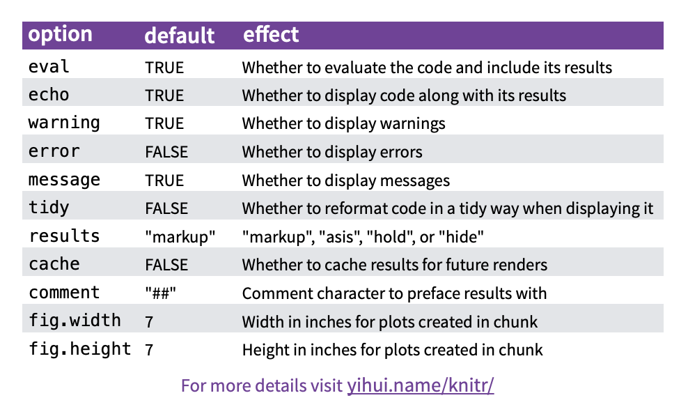

# Documentation Example - The Basics of R Markdown
```{r, echo=FALSE}
knitr::opts_chunk$set(echo = TRUE)
```

## Overview of R Markdown

R Markdown is a file format for making dynamic documents with R. An R Markdown document is written in markdown (an easy-to-write plain text format) and contains chunks of embedded R code, text, images, headers, and more. 

In this walkthrough, we'll discuss some of the functionality of R Markdown Documents and how to add images, code, and other features to the document. 

Throughout this tutorial, we'll be reviewing the contents of the R Markdown cheat sheet that has most important information for writing in Markdown. The cheat sheet can be found at https://rstudio.com/wp-content/uploads/2015/02/rmarkdown-cheatsheet.pdf.

## Workflow

One of the great features of Markdown files is that they can be rendered to PDF files, Word documents, HTML content, and more. This allows the writer to easily write in R and export the document how they see best.

Take a look at a common lifecylce of R Markdown documents in th following picture:


## Opening a New File

Writing R Markdown files is easiest within R Studio. Navigate to File > New File > R Markdown to create a new file.


## Helpful Syntax

Take a look through helpful sytax in this photo:


Here are some examples to vie. Take a look at the raw R Markdown to view the syntax in pratice.

*italics* 
**bold**
~~strikethrough~~

> Block Quote

* Bullets
* Bullets
  + subitem
  
1. Lists
2. Lists
  + subitem

## Embed Code

One of the best features of R Markdown is the ability to add code to your document. To add a code snippet, click on the green *insert* button in your R Studio tool bar and choose which language you would like to use!

```{r}
print("This is an R code snippet")
```

```{python, eval=FALSE}
print("This is a python code snippet with eval=FALSE")
```

```{bash}
echo this a bash code snippet
```


There are also many options for your code snippets. Take a look:



## Wrapping (or knitting) it Up

To knit your Markdown file you click the blue *knit* button in your R Studio toolbar. You can choose which file format you would like to knit to as well! 

For the purposes of our Merck-Data Mine documentation book, however, we will not have to knit anything because we are placing the individual documents in one bookdown book. To learn more about bookdown take a look at https://bookdown.org/yihui/bookdown/introduction.html for more information.