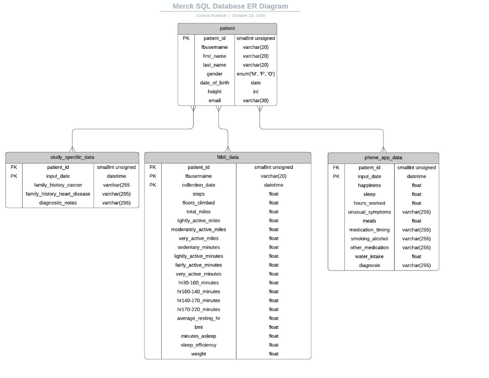
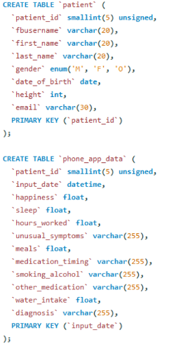
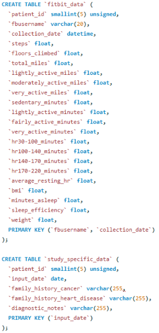
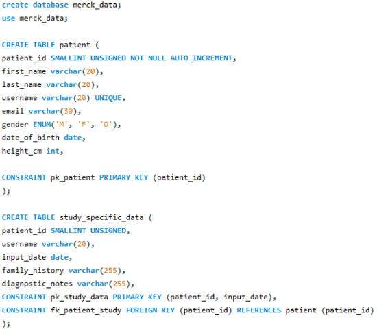
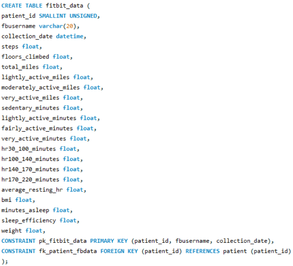
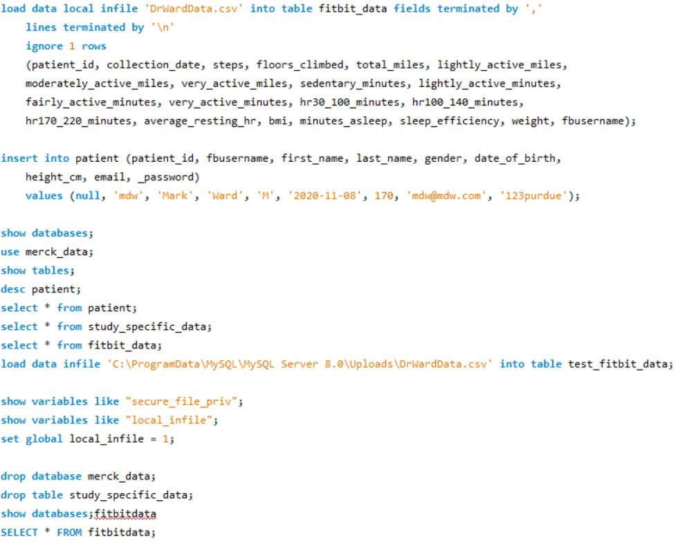

#Data Architects

##Background

What is a database?

A database is an organized collection of data stored electronically. It is typically controlled by a database management system (DBMS). There are two main categories a database can fall into: relational and non-relational. A relational database is one that stores data in rows and columns, otherwise known as a table. While a simple database may include only one table, a typical functional database contains multiple tables. These tables are linked to each other using keys. A primary key is a unique identifier and is referenced by other tables. When in another table, it is considered a foreign key. While it is not necessary, it is common practice to include a primary key in every table. Nearly all relational databases rely on the programming language SQL (Structured Query Language) to query, manipulate, and define data, as well as proved access control. 
The term “non-relational database” is a blanket term for all other databases that do not rely on SQL, hence their other name, NoSQL. These databases can take on many forms: key-value store, document store, column-oriented databases, and graph databases, to name a few.

##Database Design

Designing a relational database is straightforward. First, the data that will go into the database must be known, along with the datatypes. Next, an entity relationship diagram (ERD) should be constructed. This will help keep the design of the database organized. There are plenty of excellent free tools on the internet that help with design and construction. Lucidchart is one of these tools. Lucidchart allows one to design an ERD and then export it as an SQL script! This can be handy, especially when first starting out with SQL. 
Below is the ERD for the current (at the time of writing this) working database. PK stands for primary key, and FK stands for foreign key. This ERD includes the datatypes as well, which is necessary for properly creating a database. 

{width=50%}

Database Creation with SQL
Exporting the ERD above results in the following SQL code:

{width=50%}
{width=50%}

However, this code lacks a few required pieces. The foreign keys did not populate, and the primary keys do not reference the other tables. We also have not “created” a database yet, nor told our program which database to use. These issues are fixed in the following code snippet, along with some syntax changes. These syntax changes were necessary because the server our database is hosted on has some requirements that are not very important (at least not right now). 

{width=50%}
{width=50%}
{width=50%}

The following snippets are useful commands for handling the database.

{width=50%}

##Database Creation with Neo4j

###Neo4j Background 

Neo4j is a graph database created by Neo4j inc. Neo4j is implemented in Java; however, it can also be written with any other cypher query language. 

##Code

This creates the first two nodes. The yellow highlight section would be the user node. The green highlight section shows the relationship between the two nodes. The orange highlight section shows the other node which would be the username. The light blue highlighted section returns and stores the two nodes into the system. 

```{r,eval=FALSE}
1. create(u:user {name:'User'})-[:makes]->(n:user{name:'Username'}) return u,n
```

The yellow highlighted section codes the user node again. Instead of creating a new node for User we can just match the node with the new node you want to create. The green highlighted section describes the relationships between the two nodes. The blue highlighted section is the code for the new node. The orange highlighted section is the code for return which would store the nodes into the system. 

```{r, eval=FALSE} 
2. match(u:user {name:'User'}) create (u)-[:enters]-> (DA:user{name: 'Date of Birth'}) return u,DA
```
 
This line of code codes for a new node “Last Name” which stores the last name of the patient. This node holds a relationship with the User node. 

```{r, eval=FALSE}
3. match(u:user {name:'User'}) create (u)- [:enters]-> (LN:user{name:'Last Name'}) return u,LN
```

Similar to the code on the third line. A new node has been created, however this node is created to store the last name of the user. 

```{r, eval=FALSE}
4. match(u:user {name:'User'}) create (u)- [:enters]-> (FN:user{name:'First Name'}) return u,FN
```

A new node is created with this code. The node stores the Height of the user. 

```{r, eval=FALSE}
5. match(u:user {name:'User'}) create (u)- [:enters]-> (H:user{name:'Height'}) return u,H
```

The ID node is created, thus allowing for the user id to be stored.

```{r, eval=FALSE}
6. match(u:user {name:'User'}) create (u)- [:enters]-> (I:user{name:'ID'}) return u,I
```

This line of code codes for a new node “Merck Data” which stores the last name of the patient. This node holds a relationship with the ID node. 

```{r, eval=FALSE}
7. match(I:user{name:'ID'}) create (I)- [:enters]-> (M:user{name:'Merck Data'}) return I,M
```
	
This line of code codes for a new node “Family History Cancers” which stores the family history cancers of the patient. This node holds a relationship with the Merck Data node.

```{r, eval=FALSE}
8. match(M:user{name:'Merck Data'}) create (M)- [:enters]-> (FH:user{name:'Family History Cancers'}) return M,FH
```

Lines 9, 10, and 11 all  code for three new nodes “Diagnostic notes”, “ Any other family history disease”, and “Input Data”. This node holds a relationship with the Merck Data node.

```{r, eval=FALSE}
9.	match(M:user{name:'Merck Data'}) create (M)- [:enters]-> (ID:user{name:'Input Data'}) return M,ID
10.	match(M:user{name:'Merck Data'}) create (M)- [:enters]-> (DN:user{name:'Diagnostic Notes'}) return M,DN
11.	match(M:user{name:'Merck Data'}) create (M)- [:enters]-> (AD:user{name:'Any other family history in disease'}) return M,AD
```

This line of code helps put together all of the nodes. This is to help you check your database while you add new nodes. This line of code will be used throughout to double check the code, and to endure every branch is in the correct spot. 

```{r, eval=FALSE}
12.	MATCH (n:user) RETURN n LIMIT 100
```

This code creates the relationship between the node “Username” and the new node “fitbit data”. The new node will store fitbit data.

```{r, eval=FALSE}
13. match(n:user{name:'Username'}) create (n)- [:enters]-> (FD:user{name:'FitBit Data'}) return n, FD
```

Lines 14,15,16,17,18, and 19 all create new nodes with the fit bit data node. All the new nodes are highlighted in yellow.

```{r, eval=FALSE}
14.	match(FD:user{name:'FitBit Data'}) create (FD)- [:enters]-> (WE:user{name:'Weight'}) return FD,WE
15.	match(FD:user{name:'FitBit Data'}) create (FD)- [:enters]-> (CD:user{name:'Collection Date'}) return FD,CD
16.	match(FD:user{name:'FitBit Data'}) create (FD)- [:enters]-> (B:user{name:'BMI'}) return FD,B
17.	match(FD:user{name:'FitBit Data'}) create (FD)- [:enters]-> (FC:user{name:'Floors Climbed'}) return FD,FC
18.	match(FD:user{name:'FitBit Data'}) create (FD)- [:enters]-> (ARH:user{name:'Average Resting Hr'}) return FD,ARH
19.	match(FD:user{name:'FitBit Data'}) create (FD)- [:enters]-> (ST:user{name:'Steps'}) return FD,ST
```

This line of code codes for a new node “Miles” which stores the miles of the patient. This node holds a relationship with the Fitbit Data Node

```{r, eval=FALSE}
20.	match(FD:user{name:'FitBit Data'}) create (FD)- [:enters]-> (Mi:user{name:'Miles'}) return FD,Mi
```

Lines 20,21,22,23,24,25 all code for new nodes that hold relationships with the Fitbit node. 

```{r, eval=FALSE}
21.	match(FD:user{name:'FitBit Data'}) create (FD)- [:enters]-> (TM:user{name:'Total Miles'}) return FD,TM
22.	match(FD:user{name:'FitBit Data'}) create (FD)- [:enters]-> (VAM:user{name:'Very Active Miles'}) return FD,VAM
23.	match(FD:user{name:'FitBit Data'}) create (FD)- [:enters]-> (LAM:user{name:'Lightly Active Miles'}) return FD,LAM
24.	match(FD:user{name:'FitBit Data'}) create (FD)- [:enters]-> (MAM:user{name:'Moderately Active Miles'}) return FD,MAM
25.	match(FD:user{name:'FitBit Data'}) create (FD)- [:enters]-> (S:user{name:'Sleep'}) return FD,S
```

Lines 26,27 all codes for new nodes that holds relationships with the “Sleep node”. 

```{r, eval=FALSE}
26.	 match(S:user{name:'Sleep'}) create (S)- [:enters]-> (SE:user{name:'Sleep Efficiency'}) return S,SE
27.	match(S:user{name:'Sleep'}) create (S)- [:enters]-> (MAS:user{name:'Minutes Asleep'}) return S,MAS
```

Lines 28,29,30,31,32,33,34,35,36 all codes for new nodes that hold relationships with the “minute node”.

```{r, eval=FALSE}
28.	match(FD:user{name:'FitBit Data'}) create (FD)- [:enters]-> (M:user{name:'Minutes'}) return FD,M
29.	match(M:user{name:'Minutes'}) create (M)- [:enters]-> (OF:user{name:'hr 140-170'}) return M,OF
30.	match(M:user{name:'Minutes'}) create (M)- [:enters]-> (SM:user{name:'Sedentary Minutes'}) return M,SM
31.	match(M:user{name:'Minutes'}) create (M)- [:enters]-> (LAM:user{name:'Lightly Active Minutes'}) return M,LAM
32.	match(M:user{name:'Minutes'}) create (M)- [:enters]-> (FAM:user{name:'Fairly Active Minutes'}) return M,FAM
33.	match(M:user{name:'Minutes'}) create (M)- [:enters]-> (VAM:user{name:'Very Active Minutes'}) return M,VAM
34.	match(M:user{name:'Minutes'}) create (M)- [:enters]-> (HR:user{name:'hr 30-100'}) return M,HR
35.	match(M:user{name:'Minutes'}) create (M)- [:enters]-> (HR1:user{name:'hr 100-140'}) return M,HR1
36.	match(M:user{name:'Minutes'}) create (M)- [:enters]-> (HR2:user{name:'hr 170-220'}) return M,HR2
```

Lines 37-49 all codes for new nodes that hold relationships with the “Pain Data” node. The highlighted portions are the new nodes.

```{r, eval=FALSE}
37.	MATCH (n:user) RETURN n LIMIT 100
38.	match(u:user {name:'User'}) create (u)- [:enters]-> (PD:user{name:'Pain Data'}) return u,PD
39.	match(PD:user{name:'Pain Data'}) create (PD)- [:enters]-> (D:user{name:'Diagnosis'}) return PD,D
40.	match(PD:user{name:'Pain Data'}) create (PD)- [:enters]-> (WI:user{name:'Water Intake'}) return PD,WI
41.	match(PD:user{name:'Pain Data'}) create (PD)- [:enters]-> (MT:user{name:'Medication Timing'}) return PD,MT
42.	match(PD:user{name:'Pain Data'}) create (PD)- [:enters]-> (DA:user{name:'Date'}) return PD,DA
43.	match(PD:user{name:'Pain Data'}) create (PD)- [:enters]-> (HA:user{name:'Happiness'}) return PD,HA
44.	match(PD:user{name:'Pain Data'}) create (PD)- [:enters]-> (OM:user{name:'Other Medication'}) return PD,OM
45.	match(PD:user{name:'Pain Data'}) create (PD)- [:enters]-> (SL:user{name:'Sleep'}) return PD,SL
46.	match(PD:user{name:'Pain Data'}) create (PD)- [:enters]-> (HW:user{name:'Hours Worked'}) return PD,HW
47.	match(PD:user{name:'Pain Data'}) create (PD)- [:enters]-> (US:user{name:'Unusual Symptoms'}) return PD,US
48.	match(PD:user{name:'Pain Data'}) create (PD)- [:enters]-> (M:user{name:'meals'}) return PD,M
49.	match(PD:user{name:'Pain Data'}) create (PD)- [:enters]-> (SA:user{name:'Smoking/Alcohol'}) return PD,SA
```
