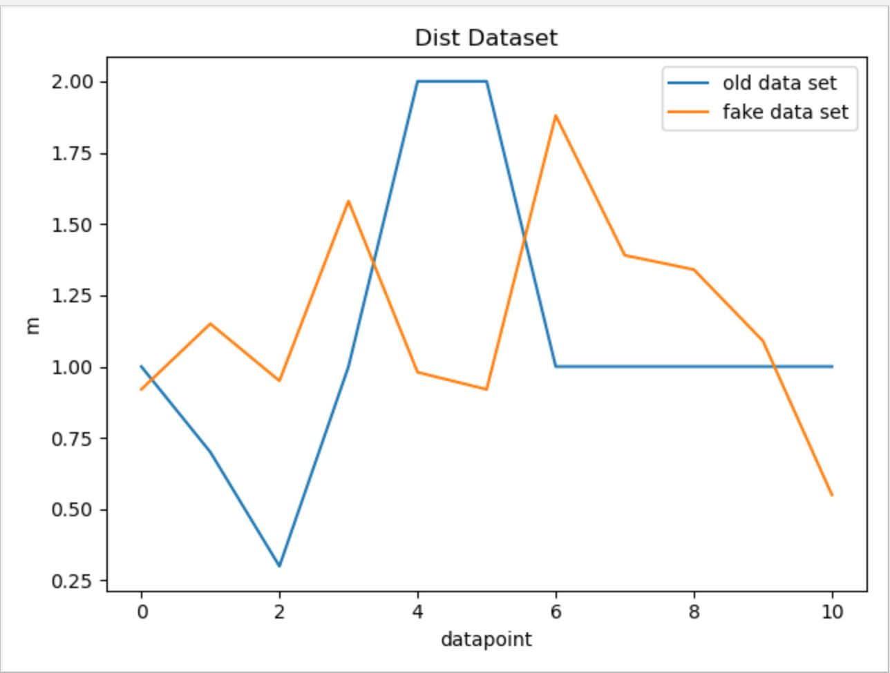

# Creation of Dummy Data

## Why do we need dummy data?
In order to effectively test the functionality of the backend code, a lot of pre-existing data is needed to fill the database to simulate a normal functioning environment for the app. Initially, we only had about 40 users' data, and it was not enough. Therefore, we decided to create fake user data based on pre-existing user data (dummy data).

## How we generated dummy data?
In order to let dummy data make sense and follow pre-existing data's patterns, we studied the patterns of each pre-existing data category. There are active, basal, dist, elev, heart, and steps data. We mostly used user 185 and 186's dataset as the reference while creating dummy dataset. 

For the active data, we first calculated the mean value of the original data. Then we found out the number of data points above the mean. Because it can be observed that within each active data set, data points above the mean value cluster into three group, and one of them always starts at the beginning. Therefore, we also chose the start as the position of the first high value data cluster, and randomly chose position for the other two. The value of each data point was chosen based on the observed range of the reference data point. 

The result of fake data vs. real data graph can be found below:\
{width=50%}

For other data categories, we utilized similar approaches while ajusting parameters and the possible range of random number generation based on each data categories' own characteristics. Below are the fake data vs. real data comparison graphs for other data categories.

For basal data:  
{width=50%}<br/>
For Dist data:  
{width=50%}<br/>
For Elev data:  
{width=50%}<br/>
For Heart data:  
{width=50%}<br/>
For Steps data:  
{width=50%}<br/>

## How to run the scripts?
In order to run the scripts, some modifications to the GenerateFakeData.py are needed. There are three parameters that need modification: folder_name_list, real_name_list, and path. "folder_name_list" tells the name of the folders that will contain the dummy data. "real_name_list" tells the name of the reference files being used to generate dummy data. "path" is the current directory. Once these three parameters are set up correctly, just directly run the GenerateFakeData.py script with no input.

## Potential improvements
Because our dummy data generation script is specifically modified for each data set, if in the future a new type of data appears, we need to rewrite our code in order to accommodate the new data type. Therefore, we can improve our code by applying more statictical knowledge so that the code can be applied to generate dummy data from more different data types.

# Creating a connection between API Endpoints

## List of API end-points:

1. Front-End Patient User input to the database
2. Biometric Data from the FitBit API to the database
3. Data from the database to the RShiny Dashboard for visualization

## What framework we are going to use?

We are currently looking to use the framework Express.js to write the routes between the database and various API endpoints.

Express is a fast, light-weight web framework for Node.js. Express is a pretty good framework. It's the most popular node application framework out there. Express is widely used as middleware in node apps as it helps to organize your app into a MVC architecture. It's the E of the popular MEAN stack. Express manages following things very easily:

- Routing
- Sessions
- HTTP requests
- Error handling

At times writing code from scratch for above things can be time consuming. But by using express it's only a matter of few methods. Express also helps in organizing your code.

[Link to set up Node](https://medium.com/@onejohi/building-a-simple-rest-api-with-nodejs-and-express-da6273ed7ca9)

## Setting up SQL database connection:

We created a connection with the MariaDB database in our Node Rest API server to be able to send and receive data. The following link shows a tutorial on how we set up the connection.

[Link to setup SQL connection in Node](https://bezkoder.com/node-js-rest-api-express-mysql/)

## Design of the Routes

There are five kinds of routes:

**GET**: The GET method requests a representation of the specified resource. Requests using GET should only retrieve data and should have no other effect. 

**POST**: The POST method requests that the server accept the entity enclosed in the request as a new subordinate of the web resource identified by the URI. The data POSTed might be, for example, an annotation for existing resources; a message for a bulletin board, newsgroup, mailing list, or comment thread; a block of data that is the result of submitting a web form to a data-handling process; or an item to add to a database.

**PUT**: The PUT method requests that the enclosed entity be stored under the supplied URI. If the URI refers to an already existing resource, it is modified; if the URI does not point to an existing resource, then the server can create the resource with that URI.

**DELETE**: The DELETE method deletes the specified resource.

**PATCH**: The PATCH method applies partial modifications to a resource

# Hosting the database on a Server

## Issues faced with hosting a database on Scholar:

1. Scholar is a small computer cluster, suitable for classroom learning about high performance computing (HPC). 
2. It can be accessed as a typical cluster, with a job scheduler distributing batch jobs onto its worker nodes, or as an interactive resource, with software packages available through a desktop-like environment on its login servers.
3. We tried to create a connection to the sql server hosted on this server from our local but we faced issues because there was a firewall preventing access to the database from a foreign  server
4. We tried running our Backend API on scholar but we were unable to install NodeJS, MySQLWorkbench and other packages on the server without authorization.

## Work around

1. In order to install packages on scholar, we are expected to make requests to the administration with a list of all program lines to run in the form of a SLURM job.

2. The Simple Linux Utility for Resource Management (SLURM) is a system providing job scheduling and job management on compute clusters. With SLURM, a user requests resources and submits a job to a queue. The system will then take jobs from queues, allocate the necessary nodes, and execute them.

3. To submit work to a SLURM queue, you must first create a job submission file. 

More info can be found at the following link: [SLURM Job](https://www.rcac.purdue.edu/knowledge/weber/run/slurm)

## How we proceeded

Since we have to make a request each time we have to install a package, we decided to make just one request with a complete list of all installation. As a result, we wanted to host a temporary database on AWS that we can connect to and test on using our local machine.

We created a copy of the entire database on AWS with the following credentials:

- Hostname: rnr56s6e2uk326pj.cbetxkdyhwsb.us-east-1.rds.amazonaws.com
- Username: cb3i17t0aqn6a4ff
- Password: e2l4k9zn24shcj42

# Adding data to the database

## Adding a CSV to the database

1. The data engineering team had made a script that creates a CSV file with all the users FitBit data when they make a request to the API
2. We decided to make a python script to load this csv data onto the database we hosted on AWS.

## POST information

1. The JSON to add a datapoint to the database is as follows:
```text
 obj = {'collection_date': row["Date"],
           'steps': row["Steps"],
           'floors_climbed': row["Floors Climbed"],
           'total_miles': row["Total Miles"],
           'lightly_active_miles': ["Lightly Active Miles"],
           'moderately_active_miles': row["Moderately Active Miles"],
           'very_active_miles': row["Very Active Miles"],
           'sedentary_minutes': row["Sedentary Minutes"],
           'lightly_active_minutes': row["Lightly Active Minutes"],
           'fairly_active_minutes': row["Fairly Active Minutes"],
           'very_active_minutes': row["Very Active Minutes"],
           'hr30_100_minutes': row["HR 30-100 Minutes"],
           'hr100_140_minutes': row["HR 100-140 Minutes"],
           'hr140_170_minutes': row["HR 140-170 Minutes"],
           'hr170_220_minutes': row["HR 170-220 Minutes"],
           'average_resting_heartrate': row["Average Resting HR"],
           'bmi': row["BMI"],
           'sleep_efficiency': row["Sleep Efficiency"],
           'weight': row["Weight"],
           'minutes_asleep': row["Minutes Alseep"],
           'fbusername': row["username"]
           }
```

2. We made structures in this form by reading the CSV information into a pandas dataframe and made a post request to our API

## Patient information and Study Specific Data

The patient information is sent to the database form a webpage which will be used by Merck Scientists to load the patients they are studying during a clinical trial.

The JSON for a patient is as follows:
```text
{
  patient_id,
  fbusername,
  first_name,
  last_name,
  gender,
  date_of_birth,
  height
}
```

The JSON for the study data is as follows:
```text
{
    patient_id,
    input_date,
    family_history_cancer,
    family_history_heart_disease,
    diagnostic_notes
}
```

# Firebase and Login System for the Phone App

(This part is also in frontend team's documentation, because it is relavant to both of the teams)
Because our app’s users are patients and their information is very confidential, It is important to implement our login and authentication system securely. Instead of building a secure login system from scratch by ourselves, we chose to use a pre-existing login authentication solution--firebase. In firebase, users’ passwords are first encrypted and then stored. Even if hackers successfully gain access to firebase’s database, they still would not know the passwords because everything stored there is the encrypted version. 

The next step is to incorporate the firebase login system into our own database. Our current thought is that, once the user logs in through firebase, they will receive a key from firebase. Then whenever they want to modify or store data in our database, they send the key along with every HTTP request. The backend would check the correctness of the key and only allow accessibility if the key is correct.
