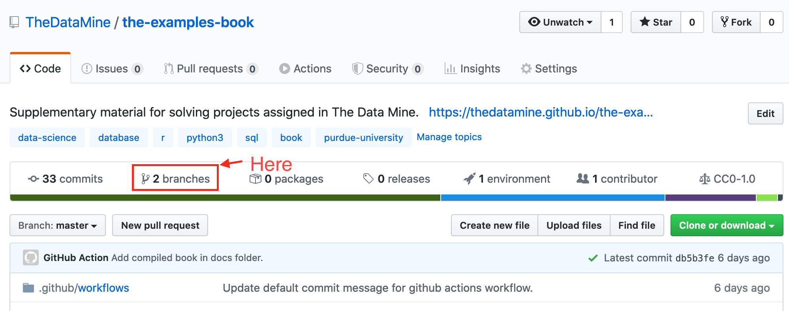
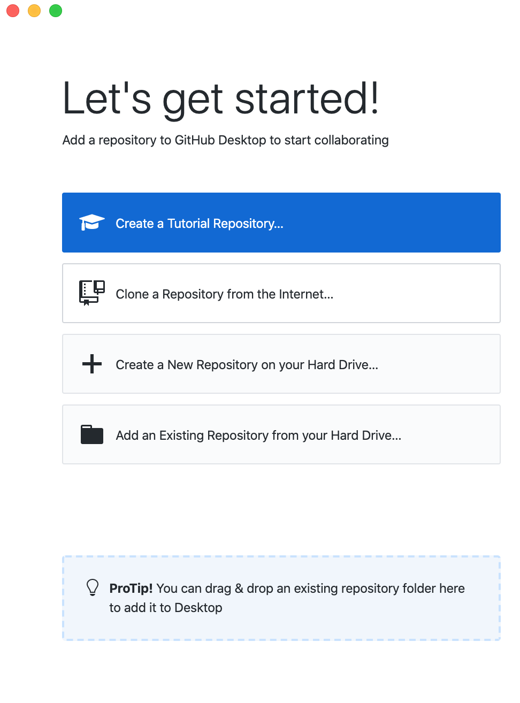
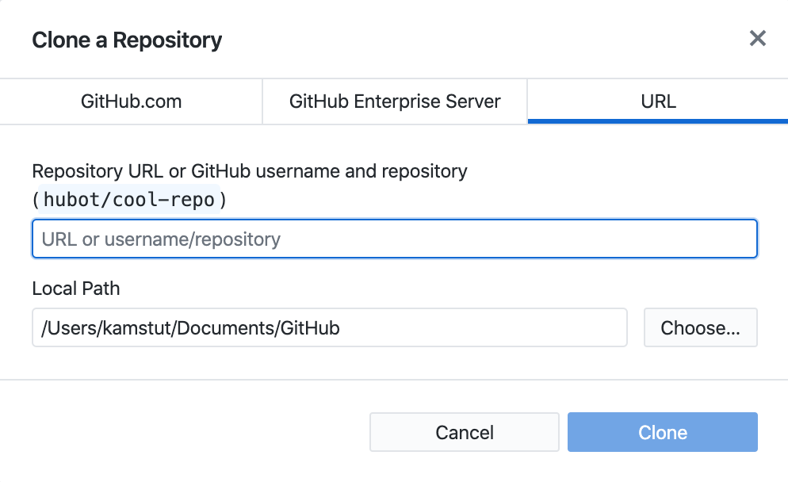
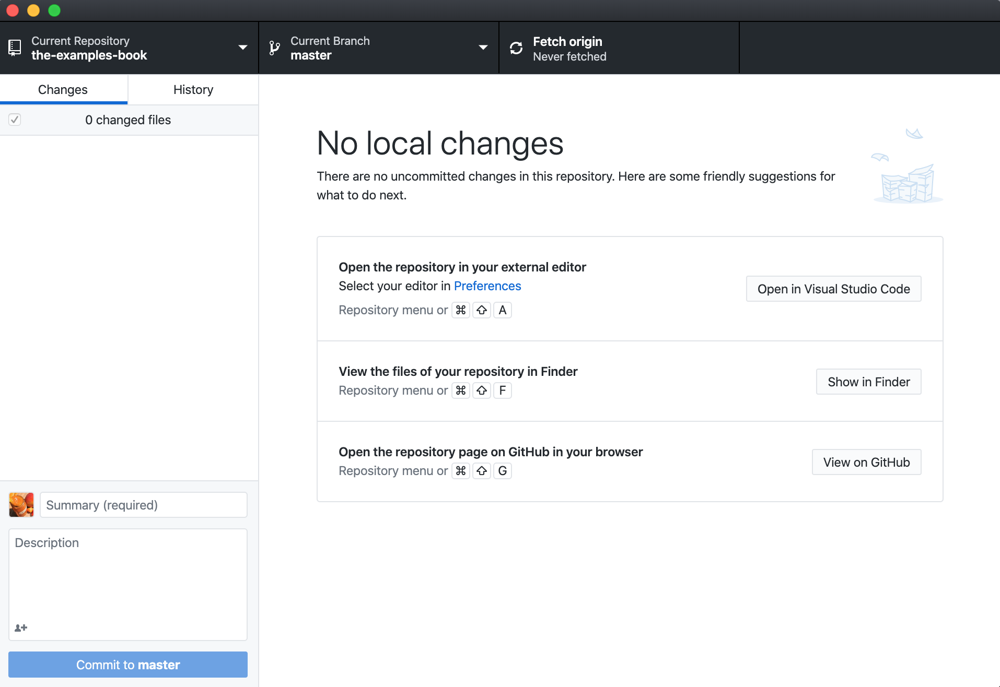
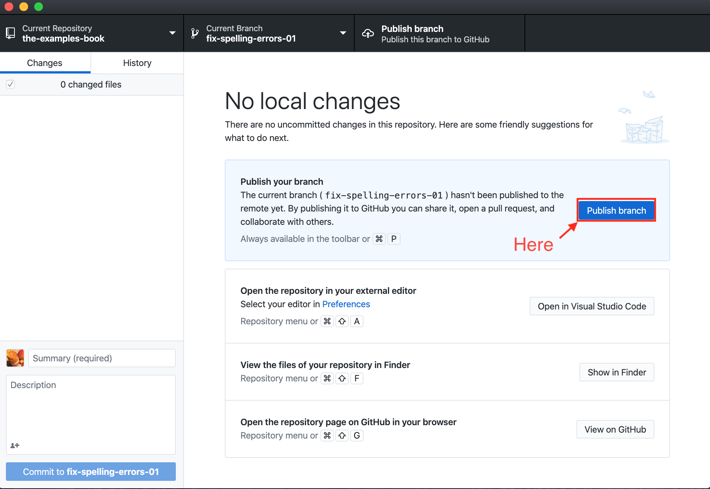

--- 
title: "Merck-Data Mine Documentation"
author: "Merck and Data Mine Corporate Partnership Team"
date: "`r Sys.Date()`"
site: bookdown::bookdown_site
output: bookdown::gitbook
documentclass: book
biblio-style: apalike
link-citations: yes
description: "A book for documenting the Merck-Data Mine team's work."
---

# Introduction {#introduction}

This book will serve as tutorial based documentation for the Merck - Data Mine Coporate Partnership team for the 2020-2021 academic year.

## How to contribute {#how-to-contribute}

Contributing to this book is simple:


### Larger changes or additions

If you have larger changes or additions you'd like to make to the book, the easiest way is to edit the contents of the book on your local machine. 

#### Using `git` in the terminal

1. Setup `git` following the directions [here](#git-install).
2. Start by opening up a terminal and [configuring `git` to work with GitHub](#configure-git).
3. Navigate to the directory in which you would like to clone the-examples-book repository. For example, if I wanted to clone the repository in my `~/projects` folder, I'd first execute: `cd ~/projects`. 
4. [Clone the repository](#git-clone-repository). In this example, let's assume I've cloned the repository into my `~/projects` folder.
5. Navigate into the project folder:

```bash
cd ~/projects/the-examples-book
```

6. At this point in time your current branch should be the `master` branch. You can verify by running:


```bash
git branch
```

**Note:** The highlighted branch starting with "*" is the current branch.

or if you'd like just the name of the branch:

```bash
git rev-parse --abbrev-ref HEAD
```

7. [Create a new branch](#git-create-new-branch) with whatever name you'd like, and check that branch out. For example, `fix-spelling-errors-01`.

8. Open up RStudio. In the "Files" tab in RStudio, navigate to the repository. In this example, we would navigate to `/Users/kamstut/Documents/GitHub/the-examples-book`. Click on the "More" dropdown and select "Set As Working Directory". 
9. If you do not already have `renv` installed, install it by running the following commands in the console:

```r
install.packages("renv")
```

10. Restore the environment by running the following commands in the console:

```r
renv::restore()
```

11. In order to compile this book, you must have LaTeX installed. The easiest way to accomplish this is to run the following in the R console:

```r
install.packages("tinytex")
library(tinytex)
tinytex::install_tinytex()
```

12. In addition, make sure to install both `pandoc` and `pandoc-citeproc` by following the instructions [here](https://pandoc.org/installing.html).

13. Modify the `.Rmd` files to your liking. 
14. Click the "Knit" button to compile the book. The resulting "book" is within the "docs" folder.

**Important note:** If at any point in time you receive an error saying something similar to "there is no package called `my_package`, simply install the missing package, and try to knit again:

```r
install.packages("my_package")
library(my_package)
```

15. To test the book out, navigate to the "docs" folder and open the `index.html` in the browser of your choice. 
16. When you are happy with the modifications you've made, [commit your changes](#git-commit-changes) to the repository.
17. You can continue to make modifications and commit your changes locally. When you are ready, you can [push your branch](#git-push-local-commits) to the remote repository (github.com).
18. At this point in time, you can confirm that the branch has been succesfully pushed to github.com by navigating to the repository on github, and click on the "branches" tab:



19. Next, [create a pull request](). Note that a "Pull Request" is a GitHub-specific concept. You cannot create a pull request using `git`. Navigate to the repository https://github.com/thedatamine/the-examples-book, and you should see a message asking if you'd like to create a pull request:


20. Leave a detailed comment about what you've modified or added to the book. You can click on "Preview" to see what your comment will look like. [GitHub's markdown](https://help.github.com/en/github/writing-on-github/basic-writing-and-formatting-syntax) applies here. Once satisfied, click "Create pull request". 

21. At this point in time, the repository owners will receive a notification and will check and potentially merge the changes into the `master` branch.


#### Using GitHub Desktop

1. Setup GitHub Desktop following the directions [here](#github-desktop-install).
2. When you are presented with the following screen, select "Clone a Repository from the Internet...":


3. Click on the "URL" tab:



4. In the first field, enter "TheDataMine/the-examples-book". This is the repository for this book.
5. In the second field, enter the location in which you'd like the repository to be cloned to. In this example, the repository will be cloned into `/Users/kamstut/Documents/GitHub`. The result will be a new folder called `the-examples-book` in `/Users/kamstut/Documents/GitHub`. 
6. Click "Clone".
7. Upon completion, you will be presented with a screen similar to this:



8. At this point in time, your current branch will be the `master` branch. [Create a new branch](#github-desktop-create-new-branch) with whatever name you'd like. For example, `fix-spelling-errors-01`.
9. Open up RStudio. In the "Files" tab in RStudio, navigate to the repository. In this example, we would navigate to `/Users/kamstut/Documents/GitHub/the-examples-book`. Click on the "More" dropdown and select "Set As Working Directory". 
10. If you do not already have `renv` installed, install it by running the following commands in the console:

```r
install.packages("renv")
```

11. Restore the environment by running the following commands in the console:

```r
renv::restore()
```

12. In order to compile this book, you must have LaTeX installed. The easiest way to accomplish this is to run the following in the R console:

```r
install.packages("tinytex")
library(tinytex)
tinytex::install_tinytex()
```

13. In addition, make sure to install both `pandoc` and `pandoc-citeproc` by following the instructions [here](https://pandoc.org/installing.html).

14. Modify the `.Rmd` files to your liking. 
15. Click the "Knit" button to compile the book. The resulting "book" is within the "docs" folder.

**Important note:** If at any point in time you receive an error saying something similar to "there is no package called `my_package`, simply install the missing package, and try to knit again:

```r
install.packages("my_package")
library(my_package)
```

16. To test the book out, navigate to the "docs" folder and open the `index.html` in the browser of your choice. 
17. When you are happy with the modifications you've made, [commit your changes](#github-desktop-commit-changes) to the repository.
18. You can continue to make modifications and commit your changes locally. When you are ready, you can [publish your branch](#github-desktop-publish-branch):



19. Upon publishing your branch, within GitHub Desktop, you'll be presented with the option to [create a pull request](#github-desktop-pull-request):


20. At this point in time, the repository owners will receive a notification and will check and potentially merge the changes into the `master` branch.
© 2020 GitHub, Inc.
Terms
Privacy
Security
Status
Help
Contact GitHub
Pricing
API
Training
Blog
About
